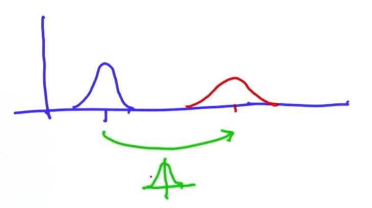
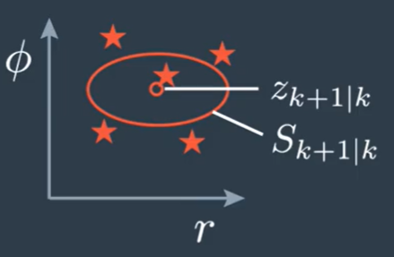

# SFND Unscented Kalman Filter


<p align="center">

</p>
<p align="center">
Simulated environment
</p>


This project implements an Unscented Kalman Filter to estimate the state of multiple cars on a highway using noisy lidar and radar measurements. The goal is to keep RMSE values below the tolerances.

---

## Dependencies for Running Locally 
* cmake >= 3.5
  * All OSes: [click here for installation instructions](https://cmake.org/install/)
* make >= 4.1 (Linux, Mac), 3.81 (Windows)
  * Linux: make is installed by default on most Linux distros
  * Mac: [install Xcode command line tools to get make](https://developer.apple.com/xcode/features/)
  * Windows: [Click here for installation instructions](http://gnuwin32.sourceforge.net/packages/make.htm)
* gcc/g++ >= 5.4
  * Linux: gcc / g++ is installed by default on most Linux distros
  * Mac: same deal as make - [install Xcode command line tools](https://developer.apple.com/xcode/features/)
  * Windows: recommend using [MinGW](http://www.mingw.org/)
 * PCL 1.2

## Basic Build Instructions

1. Clone this repo.
2. Make a build directory: `mkdir build && cd build`
3. Compile: `cmake .. && make`
4. Run it: `./ukf_highway`

---

# Readme sections

The sections below discuss how each of topics of interest was addressed in the Project. Topics discussed are:
1. Intro into the simulation
2. Intro into Kalman Filters
3. Unscented Kalman Filter
3.1 UKF Roadmap
3.2 Prediction step
3.3 Update step
3.4 Choosing the Parameters
4. Next steps


## FP.1 Intro into the simulation

<p align="center">

</p>
<p align="center">
Simulated vehicles position
</p>

`main.cpp` is using `highway.h` to create a straight 3 lane highway environment with 3 traffic cars and the main ego car at the center. 
The viewer scene is centered around the ego car and the coordinate system is relative to the ego car as well. The ego car is green while the 
other traffic cars are blue. The traffic cars will be accelerating and altering their steering to change lanes. Each of the traffic car's has
it's own UKF object generated for it, and will update each indidual one during every time step. 

The red spheres above cars represent the (x,y) lidar detection and the purple lines show the radar measurements with the velocity magnitude along the detected angle. The Z axis is not taken into account for tracking, so you are only tracking along the X/Y axis.

## FP.2 Intro into Kalman Filters

The Kalman Filter represents our distributions by Gaussians and iterates across 2 main cycles:
* Measurement Update
* Motion Update

#### FP.2.1 Measurement Update
Each new measurement update reduces the uncertainty of the position of the object we are trying to localize. New position will have a mean higher then the previous positions mean and higher then the measurement mean because with each measurement we are adding information. 


<p align="center">

</p>
<p align="center">
Measurement Update
</p>

Measurement always give us a more focused estimate (higher mean and narrower covariance) of our actual position, regardless how far away it is from our current position information.


#### FP.2.2 Motion Update
Motion, since it has it's own uncertainty (we are never 100% certain in our actuall trajectory) will add uncertainty to our initial one and our end position will have an increased uncertainty when compared to the starting point.

<p align="center">

</p>
<p align="center">
Motion Update
</p>

#### FP.2.3 Kalman Prediction

If we do estimation in higher dimensional spaces Kalman filter is able to implicitly provide us with the velocity of the object and then use this velocity estimate to make a prediction on the objects future position. While sensor itself might be only able to detect position, Kalman Filter infers the velocity information by observing multiple positions. This makes Kalman Filter excellent in tracking applications.

<p align="center">

</p>
<p align="center">
Kalman Prediction
</p>

#### FP.2.4 Kalman Filter in Sensor Fusion

Kalman Filter can use multiple sensors input when implementing object tracking which makes it very useful in Sensor Fusion applications.

<p align="center">

</p>
<p align="center">
Two step estimation problem
</p>

This approach can be generalized to multiple sensors and this is where Kalman Filter application in Sensor Fusion comes forward. We can use Lidar and Radar sensor, which will update our position information asynchronously as the new measurment sample becomes available from one or the other.

<p align="center">

</p>
<p align="center">
Kalman Filtering with multiple sensors
</p>

As the system work it will first do a Prediction using the information available and then it will do a Measurement update from one of the sensors which will give us a more precise infomation about the object we are tracking.


<p align="center">

</p>
<p align="center">
Object tracking
</p>

#### FP.2.5 Extended Kalman Filter

Extended Kalman Filter extends the Kalman Filter by approximating the non-linear measurement function (from radar) using the Taylor extension with a linear function that enables us to use the Kalman Filter in case where we have a non-linear equations, coming from Radar measurements (they are in polar coordinates, and need to be transfered to Cartesian coordinate system, in which our movement model is defined).

Beacuse the linearization points change Jacobians need to be recomputed in every measurement step.

If we would use Lidar alone with a linear motion model, we would be able to use the Kalman Filter directly. Since we use Lidar plus Radar, because of the non-linearity the Radar introduces we need to use Extended or Unscented Kalman Filter

Extended Kalman Filter is often used in Adaptive Cruise Control applications.


## FP.3 Unscented Kalman Filter

Unscented Kalman Filter uses a so-called Sigma Points to linearize the non-linear function. This has 2 benefits over the Extended Kalman Filter.
* In many cases Sigma Points approximate the non-linear function better then the linearization does.
* It is not necessary to calculate the Jacobian Matrix which makes it faster then the EKF

### FP.3.1 CTRV Motion Model

For the purpose of predicting the position of the tracked object in the future, there are many motion models we can potentially use:
* Constant Turn Rate and Velocity magnitude model - CTRV
* Constant Turn Rate and Acceleration - CTRA
* Constant Steering Angle and Velocity - CSAV
* Constant Curvature and Acceleration - CCA

Each model introduces its assumptions with the goal of simplifying the calculation of the motion. In the Unscented Kalman Filter we will use the CTRV, which assumes that the objects can move straigth and that they can also turn with a constant turn rate and velocity magnitude. If we would use a simpler model, for example a Constant Velocity model, this model would be sufficiently precise as long as the the Vehicle is moving in a straigth line. As soon as the Vehicle starts turning the model would start to introduce errors since it would predict the trajectory incorrectly and the pose estimation would tend to result outside of the actually driven circle.


<p align="center">

</p>
<p align="center">
CTRV Motion Diagram
</p>

With the CTRV model we will extend our state vector that until now had only position information by adding the the speed, yaw and the yaw rate.


<p align="center">

</p>
<p align="center">
CTRV State Vector
</p>

Process model consists from the deterministic part and the stochatic part. Stochastic part is used to model the uncertainty of the Motion model and for this we use a Noise Vector constisting of two independent scalar noise processes:
* Longitudinal acceleration noise,
* Yaw acceleration noise,

both normally distributed white noise processed with zero mean.


### FP.3.2 Unscented Transformation

To deal with motion and measurement models non-linearities, the UKF uses the Unscented Transformation. If our initial position of the object is described with a Gaussian, and our motion model is non-linear, the prediction of the position of the object in the future (t+1), that such a model would produce will be non-linear and it would not possible for it to be described with a Gaussian distribution anymore.

<p align="center">

</p>
<p align="center">
Non-linear prediction
</p>

The Unscented Transformation solves this problem by using Sigma Points. Basically we do not transform the entire state distribution through a non-linear fuction but instead we sample individual points on the distribution, the Sigma Points, and we transform them. The points are chosen around a mean state space in a certain relation to the standard deviation sigma of every state dimension, which is why they are called Sigma Points. After they are chose, the Sigma Points are introduced into the model. The model outputs the predicted sigma points which can be used to calculate the normal distribution. This will result in a approximation, but a relatively precise one.

<p align="center">

</p>
<p align="center">
Predicted state using sigma points
</p>

### FP.3.3 UKF Roadmap

As discussed previously UKF pipeline also consists of a two phases:
* Prediction step
* Update step

Only difference from the Kalman Filter and the Extended Kalman Filter is that in UKF the Prediction step needs to consider sigma points processing as well.

<p align="center">

</p>
<p align="center">
UKF pipeline steps
</p>

#### FP.3.3.1 Prediction Step: Augmented Sigma Points Generation

Starting point in the prediction step is generation of Sigma Points. At this point we have the posterior state Xk|k and the posterior covariance matrix Pk|k from the previous iteration and they represent the distribution of our current state for which we want to generate Sigma Points.

<p align="center">

</p>
<p align="center">
Posterior state
</p>

The number of sigma points depends on the state dimension. For a 5 dimensional state vector we will chose 11 sigma points. Sigma Points are calculated using the following equation:

<center></center>


Lambda is a design parameter that determines the position of the Sigma Points in relation to the mean state. The bigger the Lambda the further away from the mean state Sigma Points are.

It is important to note that our motion model introduces a noise vector as a non-linear effect and this has to be take into account when generating Sigma Points. 

<p align="center">

</p>
<p align="center">
Complete motion model
</p>

To to this we will build the augmented state vector which will include the noise vector:

<p align="center">

</p>
<p align="center">
Augmented State Vector
</p>

and the augmented covariance matrix:

<p align="center">

</p>
<p align="center">
Augmented Covariance Matrix
</p>

where Q is the process noise covariance matrix. This will extend the number of states to 7 which means we will need to generate more Sigma Points, 15 in total:

<p align="center">

</p>
<p align="center">
Augmented Sigma Points Generation
</p>

This has been implemented in the ```GenerateSigmaPointsAugmented() ``` function shown below>
```cpp 
void UKF::GenerateSigmaPointsAugmented(){

  // Generating sigma points on the of space distribution 

  // create augmented mean state
  x_aug.head(5) = x;
  x_aug(5) = 0;
  x_aug(6) = 0;

  // create augmented covariance matrix
  P_aug.fill(0.0);
  P_aug.topLeftCorner(5,5) = P;
  P_aug(5,5) = std_a_*std_a_;
  P_aug(6,6) = std_yawdd_*std_yawdd_;

  // Covariance P square root
  MatrixXd L = P_aug.llt().matrixL();

  // create augmented sigma points
  Xsig_aug.col(0) = x_aug;
  
  for(int i = 0; i < n_aug_; ++i){
    Xsig_aug.col(i+1) = x_aug + sqrt(lambda_ + n_aug_)*L.col(i);
    Xsig_aug.col(i+1+n_aug_) = x_aug - sqrt(lambda_ + n_aug_)*L.col(i);
  }
}
```

#### FP.3.3.2 Prediction Step: Sigma Points Prediction

After Augmented Sigma Points have been generated we need to introduce them into the motion model for the model to generate the predicted Sigma Points. The input in the process model will be 7-dimensional while output of the model will be 5-dimensional.

<p align="center">

</p>
<p align="center">
Augmented Sigma Points Prediction
</p>

Code snippet that implements Augmented Sigma Points Prediction is shown below:
```cpp
void UKF::SigmaPointPrediction(const double delta_t_){

  // Sigma points prediction
  for(int i = 0; i < 2*n_aug_+1; ++i){
    // extracting values 
    double px = Xsig_aug(0,i);
    double py = Xsig_aug(1,i);
    double v = Xsig_aug(2,i);
    double yaw = Xsig_aug(3,i);
    double yaw_vel = Xsig_aug(4,i);
    double nu_a = Xsig_aug(5,i);
    double nu_yaw_acc = Xsig_aug(6,i);

    double px_p, py_p;

    if(fabs(yaw_vel) > 0.001){
      px_p = px + v/yaw_vel*(sin(yaw + yaw_vel*delta_t_) - sin(yaw));
      py_p = py + v/yaw_vel*( cos(yaw) - cos(yaw + yaw_vel*delta_t_));
    } else {
      px_p = px + v*delta_t_*cos(yaw);
      py_p = py + v*delta_t_*cos(yaw);
    }
  
    double v_p = v;
    double yaw_p = yaw + yaw_vel*delta_t_;
    double yaw_vel_p = yaw_vel;

    // Adding noise
    px_p = px_p + 0.5*nu_a*delta_t_*delta_t_*cos(yaw);
    py_p = py_p + 0.5*nu_a*delta_t_*delta_t_*sin(yaw);
    v_p = v_p + nu_a*delta_t_;

    yaw_p = yaw_p + 0.5*nu_yaw_acc*delta_t_*delta_t_;
    yaw_vel_p = yaw_vel_p + nu_yaw_acc*delta_t_; 

    Xsig_pred(0,i) = px_p;
    Xsig_pred(1,i) = py_p;
    Xsig_pred(2,i) = v_p;
    Xsig_pred(3,i) = yaw_p;
    Xsig_pred(4,i) = yaw_vel_p;
  
  }

}
```
What is important to notice is that, in order to protect from division with zero, in the code we use different equations depending if the yaw velocity is 0 or not. If the yaw velocity is 0, we will use the simplified motion model:

<p align="center">

</p>
<p align="center">
Simplified Motion Model
</p>

#### FP.3.3.3 Prediction Step: Predicted Mean and Covariance


After we have finished with the prediction of the Sigma Points we want to use them to calculate the mean and the covariance of the predicted state.

<p align="center">

</p>
<p align="center">
Prediction of Mean and Covariance
</p>

Equation for Mean Prediction:

<center></center>

and the following equation for covariance prediction:

<center></center>

As we can see Mean and Covariance is calculated using the the weights that take into account the design parameter lambda that we chose in the Sigma Points generation step:

<center></center>

The weights are needed because we want to revert the spreading of the Sigma Points introduced with the lambda parameter.
    
Prediction of mean and covariance using the predicted sigma points is shown in the followin code snippet:

```cpp
void UKF::PredictMeanAndCovariance(){

  x.fill(0.0);
  for(int i = 0; i < 2 * n_aug_ + 1; ++i){
    x = x + weights_(i) * Xsig_pred.col(i);
  }

  P.fill(0.0);
  for(int i = 0; i < 2*n_aug_ + 1; ++i){
    // state difference
    VectorXd x_diff = Xsig_pred.col(i) - x;
    
    // angle normalization
    while(x_diff(3)> M_PI)  x_diff(3) -= 2.*M_PI;
    while(x_diff(3)< -M_PI) x_diff(3) += 2.*M_PI;

    P = P + weights_(i)*x_diff*x_diff.transpose();
  }

}
```
With this step we are finished with the Prediction phase of the UKF pipeline and we can move onto the Update phase.

#### FP.3.3.4 Update Step: Measurement Prediction
In this step we need to transform the Predicted state into the measurement space by using the measurement model. Because of this, we need to consider what kind of sensor produced the measurement and use the approapriate measurement model.

<p align="center">

</p>
<p align="center">
Measurement Prediction process
</p>

The problem we have here is very similar to the problem we had in the prediction phase - we need to transform a distribution, through a non-linear function, which means we can apply the same Unscented Transformation approach that we used in the prediction phase. To simplify the problem we will use a popular shotcut and we will skip the generation of Sigma Points. Instead we will simply reuse the already generated ones. We will also skip the augmentation step because in this case noise has a purely additive effect where previosly it had a non-linear effect so we had to take it into consideration.

Specifically in case of using a Radar measurement we will have the following measurement vector:

<center></center>

where the equations modeling the measurement are:

<center></center>

Now we can calculate the measurement prediction:

<p align="center">

</p>
<p align="center">
Predicted Measurement
</p>

using the predicted measurement mean equation:

<center></center>

and the Predicted Covariance equation:

<center></center>

R here is the measurement covariance noise that we need to add to the equation to account for the measurement noise.

The code implementing this step is given below:

```cpp
void UKF::PredictRadarMeasurement(){

  for(int i = 0; i < 2*n_aug_+1; ++i){
    // extract values for better readibility
    double px = Xsig_pred(0,i);
    double py = Xsig_pred(1,i);
    double v = Xsig_pred(2,i);
    double yaw = Xsig_pred(3,i);

    double v1 = cos(yaw)*v;
    double v2 = sin(yaw)*v;

    // Radar measurement model
    Zsig_r(0,i) = sqrt(px*px +py*py);                   // r
    Zsig_r(1,i) = atan2(py, px);                        // phi
    Zsig_r(2,i) = (px*v1 + py*v2) / sqrt(px*px +py*py); // r_vel
  }
  // mean predicted measurement
  z_pred_r.fill(0.0);
  for(int i = 0; i < 2*n_aug_+1; ++i)
    z_pred_r = z_pred_r + weights_(i)*Zsig_r.col(i);

  // innovation covariance matrix S
  S_r.fill(0.0);
  for(int i = 0; i < 2*n_aug_+1; ++i) {
    // residual
    VectorXd z_diff = Zsig_r.col(i) - z_pred_r;

    // angle normalization
    while (z_diff(1) > M_PI) 
      z_diff(1) -= 2.*M_PI;
    while (z_diff(1) < -M_PI) 
      z_diff(1) += 2.*M_PI;

    S_r = S_r + weights_(i) * z_diff * z_diff.transpose();     
  }

  S_r = S_r + R;
}
``` 

Implementation of Measurement Prediction for Lidar looks like this:
```cpp
void UKF::PredictLidarMeasurement(){

  for(int i = 0; i < 2*n_aug_+1; i++){
    // extract values for better readibility
    double px = Xsig_pred(0,i);
    double py = Xsig_pred(1,i);

    // Radar measurement model
    Zsig_l(0,i) = px;                 
    Zsig_l(1,i) = py;                 
  }

  // mean predicted measurement
  z_pred_l.fill(0.0);
  for(int i = 0; i < 2*n_aug_+1; i++)
    z_pred_l = z_pred_l + weights_(i)*Zsig_l.col(i);

  // innovation covariance matrix S
  S_l.fill(0.0);
  for(int i = 0; i < 2*n_aug_+1; i++) {
    // residual
    VectorXd z_diff = Zsig_l.col(i) - z_pred_l;

    S_l = S_l + weights_(i) * z_diff * z_diff.transpose();     
  }
  S_l = S_l + L;

}
```

#### FP.3.3.5 Update Step: State Update

State update is the last step in the UKF pipeline. In this step we use the actual measurement values for the first time. What we needed from the begining was the time of the measurement so we could predict to the correct time and the sensor type so we could use the correct measurement model in the measurement prediction step. The update calculation closes the processing chain and produces the updated state mean:

<center></center>

and the updated state covariance matrix:

<center></center>

and these equations are exactly the same as for the standard Kalman Filter. Only difference here is how we calculate the Kalman Gain:

<center></center>

because for this we need to use the cross-corelation matrix between the predicted sigma points in the state space and the predicted sigma points in the measurement space:

<center></center>

This completes the processing of the measurement in the time-step k+1 and we can now move on the time-step k+2 and repeat the processing chain.

For Lidar this step is implemented in the followin code snippet:
```cpp
void UKF::UpdateStateLidar(const VectorXd& z){

  // create matrix fro cross correlation TC
  MatrixXd Tc = MatrixXd::Zero(n_x_, n_z_L_);
  
  // calculate cross correlation matrix
  for(int i = 0; i < 2*n_aug_+1; i++) {
    // residual
    VectorXd z_diff = Zsig_l.col(i) - z_pred_l;

    // state difference 
    VectorXd x_diff = Xsig_pred.col(i) - x;

    Tc = Tc + weights_(i) * x_diff * z_diff.transpose();
  }

  // Kalman gain K
  MatrixXd K = Tc * S_l.inverse();

  // residual
  VectorXd z_diff = z - z_pred_l;

  // update state mean and covariance matrix
  x = x + K * z_diff;
  P = P - K * S_l *K.transpose();

}
```
For Radar, the State Update step is shown below:
```cpp
void UKF::UpdateStateRadar(const VectorXd& z){

  // create matrix fro cross correlation TC
  MatrixXd Tc = MatrixXd::Zero(n_x_, n_z_R_);
  
  // calculate cross correlation matrix
 
  for(int i = 0; i < 2*n_aug_+1; ++i) {
    // residual
    VectorXd z_diff = Zsig_r.col(i) - z_pred_r;

    // angle normalization
    while (z_diff(1) > M_PI) 
      z_diff(1) -= 2.*M_PI;
    while (z_diff(1) < -M_PI) 
      z_diff(1) += 2.*M_PI;

    // state difference 
    VectorXd x_diff = Xsig_pred.col(i) - x;
      
    // angle normalization
    while (x_diff(3) >  M_PI) x_diff(3) -= 2.*M_PI;
    while (x_diff(3) < -M_PI) x_diff(3) += 2.*M_PI;

    Tc = Tc + weights_(i) * x_diff * z_diff.transpose();
  }

  // Kalman gain K
  MatrixXd K = Tc * S_r.inverse();

  // residual
  VectorXd z_diff = z - z_pred_r;

  // angle normalization
  while (z_diff(1) > M_PI) 
    z_diff(1) -= 2.*M_PI;
  while (z_diff(1) < -M_PI) 
    z_diff(1) += 2.*M_PI;

  // update state mean and covariance matrix
  x = x + K * z_diff;
  P = P - K * S_r *K.transpose();

}
```

### FP.3.4 Chosing the Parameters

One of the main points of the entire algorithm is the the choice of the two parameters that define the noise for the CTRV model:
* Longitudinal acceleration noise
* Yaw acceleration noise

These quantify the strength of the noise and by that they uncertainty in the motion of the tracked object modeled by CTRV. In order to minimize the RMSE they need to be tuned.  General intuition for tuning of these parameters can come from the fact that for example, in the case of longitudinal acceleration noise, the linear acceleration is modeled as a Gaussian distribution with mean zero and standard deviation sigma. In a Gaussian distribution, about 95% of the values fall within 2 sigma. This means that if we chose longitudinal acceleration to be 9 m/s^4, we can expect the acceleration to be between -6 m/s^2 and +6 m/s^2 in 95% of the time. For the choice of yaw acceleration noise we need to think about how long it will take the tracked object to complete a circle. If we chose it to be pi/8 that would imply that the object would complete a full circle in 16 seconds.

For the project we tuned the parameters to the following values:
```cpp
  // Process noise standard deviation longitudinal acceleration in m/s^4
  std_a_ = 6.0;

  // Process noise standard deviation yaw acceleration in rad/s^4
  std_yawdd_ = 1.0;
```
They represent the facts that our tracked object will have the longitudinal acceleration in the range of -4.899  m/s^2 and 4.899  m/s^2 95% of the time. For yaw acceleration this would mean that the object would complete the circle in 2pi seconds. If we take the turning radius to be 15 meters that would give us the expected tangential velocity of the object to be also 15 m/s which seems a reasonable speed for the vehicles simulated in the project.

With these values we achieved the goals of the project that px, py, vx, vy output coordinates must have an RMSE <= [0.30, 0.16, 0.95, 0.70] after running the simulation for longer than 1 second.

<p align="center">

</p>
<p align="center">
RMSE of output coordinates
</p>

There is another set of noise parameters that describe the measurement uncertainty but they are usually given together in the sensor manuals so we can include them directly into the measurement model for each sensor.

## FP.5 Next steps

Some of the possible next steps for the project can be:
* Automating the motion noise parameters tuning by implementing a Normalized Innovation Squared calculation.
* Implementing a Kalman Filter abstract class, that would provide an API for Kalman Filter, Extended Kalman Filter and Unscented Kalman Filter.
* Refactoring the code to improve the readibility, implementing helper functions (for angle normalization for example) etc.
* Including the filter into one of the Open Source libraries.
